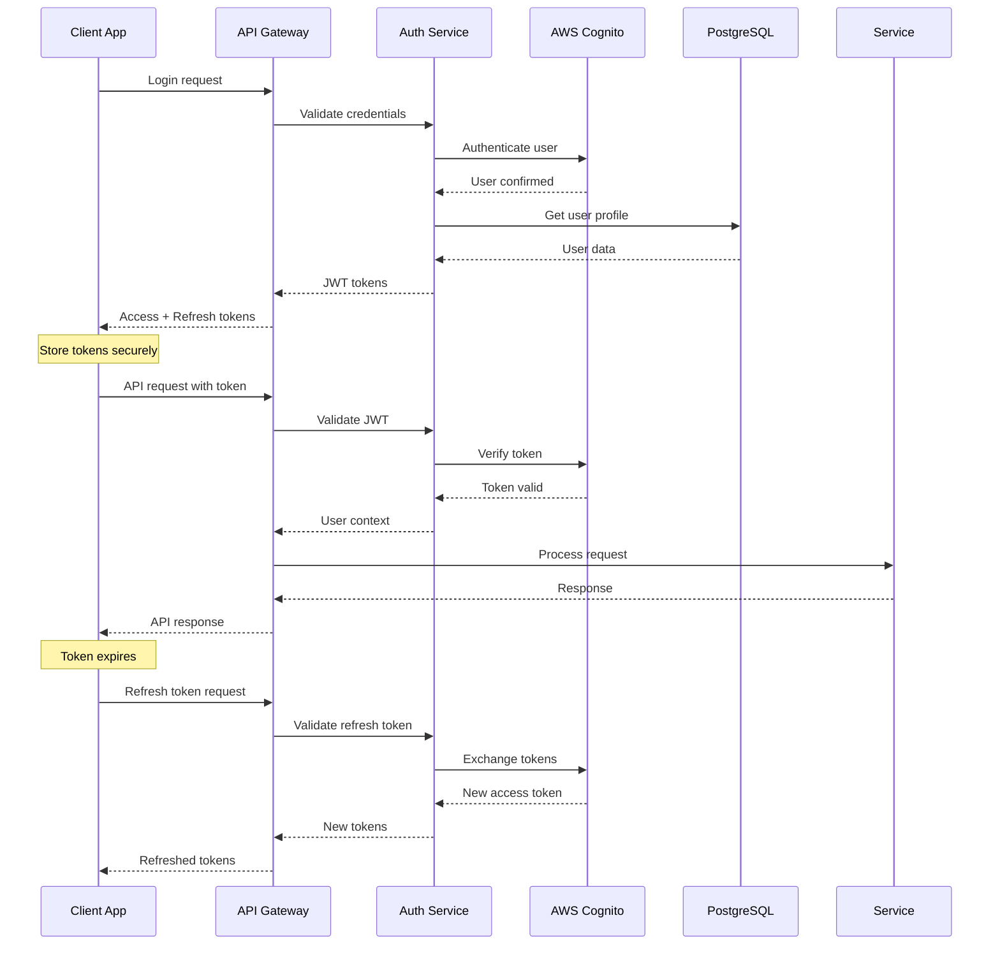

# Backend Architecture

## Service Architecture

### Function Organization

```
src/functions/
├── auth/
│   ├── register.ts
│   ├── login.ts
│   ├── refresh.ts
│   ├── forgotPassword.ts
│   └── verifyEmail.ts
├── business/
│   ├── create.ts
│   ├── search.ts
│   ├── getById.ts
│   ├── update.ts
│   └── uploadMedia.ts
├── booking/
│   ├── create.ts
│   ├── list.ts
│   ├── update.ts
│   └── getAvailability.ts
├── payment/
│   ├── createIntent.ts
│   ├── confirmPayment.ts
│   ├── processRefund.ts
│   └── webhooks.ts
├── review/
│   ├── create.ts
│   ├── list.ts
│   ├── respond.ts
│   └── moderate.ts
└── notification/
    ├── sendPush.ts
    ├── sendEmail.ts
    ├── sendSMS.ts
    └── managePreferences.ts
```

### Function Template

```typescript
import { APIGatewayProxyEvent, APIGatewayProxyResult } from 'aws-lambda';
import { validateRequest } from '../middleware/validation';
import { authenticateUser } from '../middleware/auth';
import { businessService } from '../services/businessService';
import { CreateBusinessSchema } from '../schemas/businessSchemas';
import { errorHandler } from '../utils/errorHandler';
import { successResponse, errorResponse } from '../utils/responses';

export const handler = async (
  event: APIGatewayProxyEvent
): Promise<APIGatewayProxyResult> => {
  try {
    // Authenticate user
    const user = await authenticateUser(event);
    if (!user) {
      return errorResponse(401, 'Unauthorized');
    }

    // Validate request body
    const body = JSON.parse(event.body || '{}');
    const validationResult = validateRequest(body, CreateBusinessSchema);
    if (!validationResult.isValid) {
      return errorResponse(400, 'Validation failed', validationResult.errors);
    }

    // Process business logic
    const business = await businessService.createBusiness({
      ...validationResult.data,
      ownerId: user.id,
    });

    return successResponse(201, business);
  } catch (error) {
    console.error('Error creating business:', error);
    return errorHandler(error);
  }
};
```

## Database Architecture

### Schema Design

The PostgreSQL schema is optimized for the marketplace use case with the following key design decisions:

1. **UUID Primary Keys:** Ensures scalability and prevents ID enumeration attacks
2. **JSONB Fields:** Flexible storage for complex data structures (business hours, contact info, media arrays)
3. **Spatial Indexing:** PostGIS extensions for efficient location-based queries
4. **Audit Trails:** Created/updated timestamps with automatic triggers
5. **Referential Integrity:** Foreign key constraints ensure data consistency
6. **Performance Indexes:** Strategic indexes on commonly queried fields

### Data Access Layer

```typescript
import { Pool, PoolClient } from 'pg';
import { Business, CreateBusinessInput, UpdateBusinessInput } from '../types';

class BusinessRepository {
  private pool: Pool;

  constructor(pool: Pool) {
    this.pool = pool;
  }

  async create(business: CreateBusinessInput): Promise<Business> {
    const client = await this.pool.connect();
    try {
      const query = `
        INSERT INTO businesses (
          owner_id, name, description, location, categories, 
          hours, contact, services
        ) VALUES ($1, $2, $3, $4, $5, $6, $7, $8)
        RETURNING *
      `;
      
      const values = [
        business.ownerId,
        business.name,
        business.description,
        JSON.stringify(business.location),
        business.categories,
        JSON.stringify(business.hours),
        JSON.stringify(business.contact),
        JSON.stringify(business.services),
      ];

      const result = await client.query(query, values);
      return this.mapRowToBusiness(result.rows[0]);
    } finally {
      client.release();
    }
  }

  async findById(id: string): Promise<Business | null> {
    const client = await this.pool.connect();
    try {
      const query = 'SELECT * FROM businesses WHERE id = $1 AND is_active = TRUE';
      const result = await client.query(query, [id]);
      
      if (result.rows.length === 0) {
        return null;
      }

      return this.mapRowToBusiness(result.rows[0]);
    } finally {
      client.release();
    }
  }

  async searchByLocation(
    latitude: number,
    longitude: number,
    radius: number,
    filters: {
      category?: string;
      search?: string;
      limit?: number;
      offset?: number;
    } = {}
  ): Promise<Business[]> {
    const client = await this.pool.connect();
    try {
      let query = `
        SELECT *, 
               ST_Distance(
                 ST_Point((location->>'longitude')::float, (location->>'latitude')::float)::geography,
                 ST_Point($1, $2)::geography
               ) / 1000 as distance_km
        FROM businesses
        WHERE is_active = TRUE
          AND ST_DWithin(
            ST_Point((location->>'longitude')::float, (location->>'latitude')::float)::geography,
            ST_Point($1, $2)::geography,
            $3 * 1000
          )
      `;
      
      const params = [longitude, latitude, radius];
      let paramIndex = 4;

      if (filters.category) {
        query += ` AND $${paramIndex} = ANY(categories)`;
        params.push(filters.category);
        paramIndex++;
      }

      if (filters.search) {
        query += ` AND (
          name ILIKE $${paramIndex} 
          OR description ILIKE $${paramIndex}
          OR EXISTS (
            SELECT 1 FROM jsonb_array_elements_text(services) as service
            WHERE service ILIKE $${paramIndex}
          )
        )`;
        params.push(`%${filters.search}%`);
        paramIndex++;
      }

      query += ` ORDER BY distance_km`;

      if (filters.limit) {
        query += ` LIMIT $${paramIndex}`;
        params.push(filters.limit);
        paramIndex++;
      }

      if (filters.offset) {
        query += ` OFFSET $${paramIndex}`;
        params.push(filters.offset);
      }

      const result = await client.query(query, params);
      return result.rows.map(row => this.mapRowToBusiness(row));
    } finally {
      client.release();
    }
  }

  private mapRowToBusiness(row: any): Business {
    return {
      id: row.id,
      ownerId: row.owner_id,
      name: row.name,
      description: row.description,
      location: row.location,
      categories: row.categories,
      hours: row.hours,
      contact: row.contact,
      media: row.media || [],
      services: row.services || [],
      isActive: row.is_active,
      createdAt: row.created_at,
      updatedAt: row.updated_at,
      distance: row.distance_km ? parseFloat(row.distance_km) : undefined,
    };
  }
}

export { BusinessRepository };
```

## Authentication and Authorization

### Auth Flow



### Middleware/Guards

```typescript
import jwt from 'jsonwebtoken';
import { APIGatewayProxyEvent } from 'aws-lambda';
import { CognitoJwtVerifier } from 'aws-jwt-verify';
import { User } from '../types';

const verifier = CognitoJwtVerifier.create({
  userPoolId: process.env.COGNITO_USER_POOL_ID!,
  tokenUse: 'access',
  clientId: process.env.COGNITO_CLIENT_ID!,
});

export async function authenticateUser(
  event: APIGatewayProxyEvent
): Promise<User | null> {
  try {
    const authHeader = event.headers.Authorization || event.headers.authorization;
    if (!authHeader || !authHeader.startsWith('Bearer ')) {
      return null;
    }

    const token = authHeader.substring(7);
    const payload = await verifier.verify(token);

    // Extract user information from Cognito token
    const user: User = {
      id: payload.sub,
      email: payload.email as string,
      role: payload['custom:role'] as 'consumer' | 'business_owner' | 'admin',
      // Additional user data can be fetched from database if needed
    };

    return user;
  } catch (error) {
    console.error('Authentication error:', error);
    return null;
  }
}

export function requireRole(allowedRoles: string[]) {
  return async (event: APIGatewayProxyEvent): Promise<User | null> => {
    const user = await authenticateUser(event);
    
    if (!user || !allowedRoles.includes(user.role)) {
      return null;
    }

    return user;
  };
}

// Usage in Lambda functions
export const requireBusinessOwner = requireRole(['business_owner', 'admin']);
export const requireAdmin = requireRole(['admin']);
```
