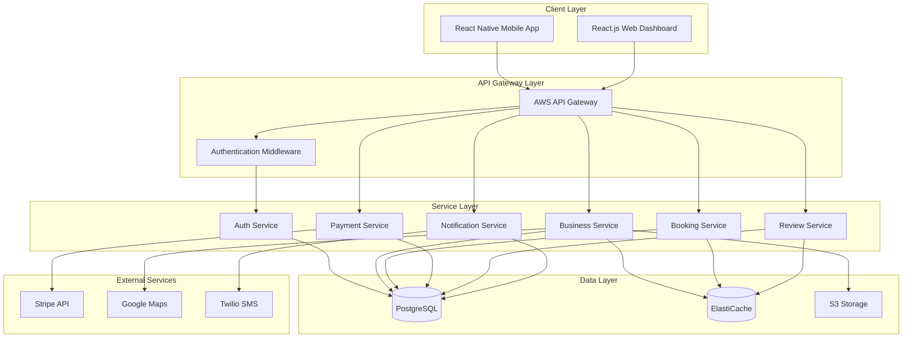

# Components

## Auth Service
**Responsibility:** User authentication, registration, password management, JWT token generation and validation, role-based access control

**Key Interfaces:**
- POST /auth/register - User registration with email verification
- POST /auth/login - User authentication with JWT tokens
- POST /auth/refresh - Token refresh and rotation
- POST /auth/forgot-password - Password reset initiation
- POST /auth/reset-password - Password reset completion
- GET /auth/verify-email - Email verification endpoint

**Dependencies:** AWS Cognito for user pool management, SES for email delivery, RDS PostgreSQL for user data storage

**Technology Stack:** Node.js/Express Lambda function, AWS Cognito integration, bcrypt for password hashing, jsonwebtoken for JWT handling

## Business Service
**Responsibility:** Business profile management, search and discovery, location-based queries, category filtering, media upload handling

**Key Interfaces:**
- GET /businesses - Search businesses with location/category filters
- POST /businesses - Create new business listing
- GET /businesses/{id} - Retrieve business details
- PUT /businesses/{id} - Update business information
- POST /businesses/{id}/media - Upload business photos
- GET /businesses/{id}/analytics - Business performance metrics

**Dependencies:** RDS PostgreSQL for business data, S3 for media storage, ElastiCache Redis for search result caching, Google Maps API for geocoding

**Technology Stack:** Node.js/Express Lambda function, PostGIS for geospatial queries, Sharp for image processing, AWS S3 SDK for file uploads

## Booking Service
**Responsibility:** Appointment scheduling, reservation management, availability tracking, calendar integration, booking lifecycle management

**Key Interfaces:**
- POST /bookings - Create new booking/reservation
- GET /bookings - List user bookings with filters
- GET /bookings/{id} - Retrieve booking details
- PUT /bookings/{id} - Update booking (reschedule/cancel)
- GET /businesses/{id}/availability - Check available time slots
- POST /bookings/{id}/confirm - Confirm pending booking

**Dependencies:** RDS PostgreSQL for booking data, ElastiCache Redis for availability caching, SNS for booking notifications, external calendar APIs (Google Calendar, Outlook)

**Technology Stack:** Node.js/Express Lambda function, node-cron for scheduled tasks, ical for calendar format handling, moment.js for date/time manipulation

## Payment Service
**Responsibility:** Payment processing, transaction management, escrow handling, refund processing, platform fee calculation, financial reporting

**Key Interfaces:**
- POST /payments/intents - Create Stripe payment intent
- POST /payments/confirm - Confirm payment completion
- POST /payments/refund - Process refund requests
- GET /payments/transactions - List transaction history
- POST /payments/payouts - Initiate business payouts
- GET /payments/fees - Calculate platform fees

**Dependencies:** Stripe API for payment processing, RDS PostgreSQL for transaction records, SNS for payment notifications, SQS for async payment processing

**Technology Stack:** Node.js/Express Lambda function, Stripe Node.js SDK, decimal.js for precise financial calculations, AWS SQS for payment queue processing

## Review Service
**Responsibility:** Review and rating management, content moderation, business response handling, review analytics, spam detection

**Key Interfaces:**
- POST /reviews - Create new review
- GET /reviews - List reviews with filters
- PUT /reviews/{id} - Update review content
- POST /reviews/{id}/response - Business response to review
- POST /reviews/{id}/helpful - Mark review as helpful
- POST /reviews/{id}/flag - Report inappropriate content

**Dependencies:** RDS PostgreSQL for review data, ElastiCache Redis for review caching, Amazon Comprehend for sentiment analysis, SNS for review notifications

**Technology Stack:** Node.js/Express Lambda function, AWS Comprehend for content analysis, node-sentiment for basic sentiment scoring, profanity-filter for content moderation

## Notification Service
**Responsibility:** Push notifications, email delivery, SMS messaging, notification preferences, delivery tracking, template management

**Key Interfaces:**
- POST /notifications/push - Send push notification
- POST /notifications/email - Send email notification  
- POST /notifications/sms - Send SMS notification
- GET /notifications/preferences - User notification settings
- PUT /notifications/preferences - Update notification preferences
- GET /notifications/history - Notification delivery history

**Dependencies:** SNS for push notifications, SES for email delivery, Twilio for SMS, RDS PostgreSQL for notification logs, AppSync for real-time updates

**Technology Stack:** Node.js/Express Lambda function, AWS SNS/SES SDKs, Twilio SDK for SMS, Handlebars for email templates, FCM for mobile push notifications

## Component Diagrams

