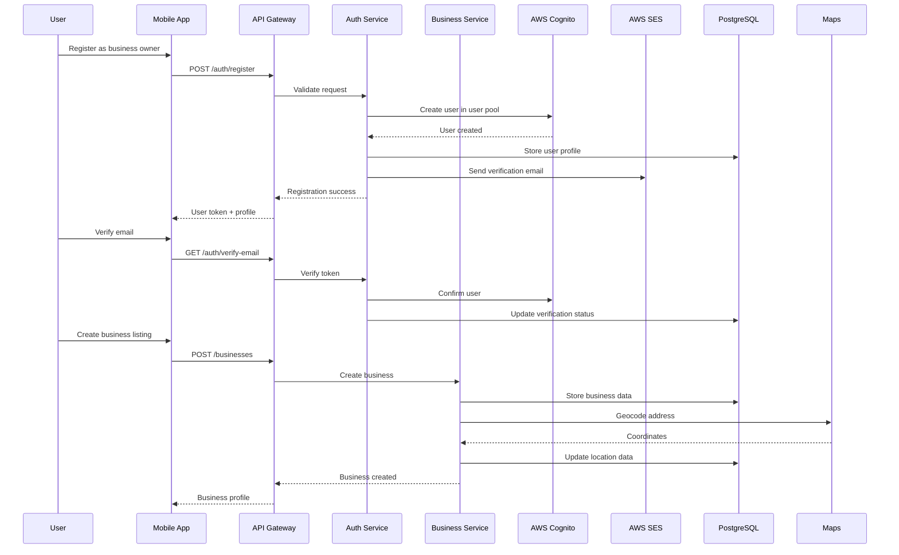
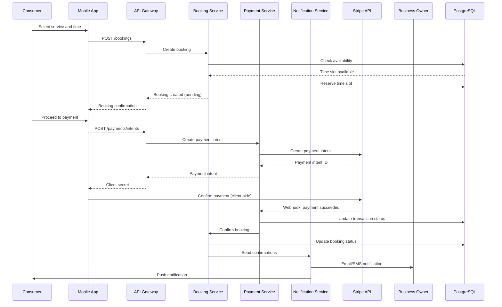

# Core Workflows

## User Registration and Business Onboarding

```mermaid
sequenceDiagram
    participant User as User
    participant Mobile as Mobile App
    participant Gateway as API Gateway
    participant Auth as Auth Service
    participant Business as Business Service
    participant Cognito as AWS Cognito
    participant SES as AWS SES
    participant RDS as PostgreSQL
    
    User->>Mobile: Register as business owner
    Mobile->>Gateway: POST /auth/register
    Gateway->>Auth: Validate request
    Auth->>Cognito: Create user in user pool
    Cognito-->>Auth: User created
    Auth->>RDS: Store user profile
    Auth->>SES: Send verification email
    Auth-->>Gateway: Registration success
    Gateway-->>Mobile: User token + profile
    
    User->>Mobile: Verify email
    Mobile->>Gateway: GET /auth/verify-email
    Gateway->>Auth: Verify token
    Auth->>Cognito: Confirm user
    Auth->>RDS: Update verification status
    
    User->>Mobile: Create business listing
    Mobile->>Gateway: POST /businesses
    Gateway->>Business: Create business
    Business->>RDS: Store business data
    Business->>Maps: Geocode address
    Maps-->>Business: Coordinates
    Business->>RDS: Update location data
    Business-->>Gateway: Business created
    Gateway-->>Mobile: Business profile
```

## Booking and Payment Flow

```mermaid
sequenceDiagram
    participant Consumer as Consumer
    participant Mobile as Mobile App
    participant Gateway as API Gateway
    participant Booking as Booking Service
    participant Payment as Payment Service
    participant Notification as Notification Service
    participant Stripe as Stripe API
    participant Business as Business Owner
    participant RDS as PostgreSQL
    
    Consumer->>Mobile: Select service and time
    Mobile->>Gateway: POST /bookings
    Gateway->>Booking: Create booking
    Booking->>RDS: Check availability
    RDS-->>Booking: Time slot available
    Booking->>RDS: Reserve time slot
    Booking-->>Gateway: Booking created (pending)
    Gateway-->>Mobile: Booking confirmation
    
    Consumer->>Mobile: Proceed to payment
    Mobile->>Gateway: POST /payments/intents
    Gateway->>Payment: Create payment intent
    Payment->>Stripe: Create payment intent
    Stripe-->>Payment: Payment intent ID
    Payment-->>Gateway: Payment intent
    Gateway-->>Mobile: Client secret
    
    Mobile->>Stripe: Confirm payment (client-side)
    Stripe->>Payment: Webhook: payment succeeded
    Payment->>RDS: Update transaction status
    Payment->>Booking: Confirm booking
    Booking->>RDS: Update booking status
    Booking->>Notification: Send confirmations
    Notification->>Business: Email/SMS notification
    Notification->>Consumer: Push notification
```
