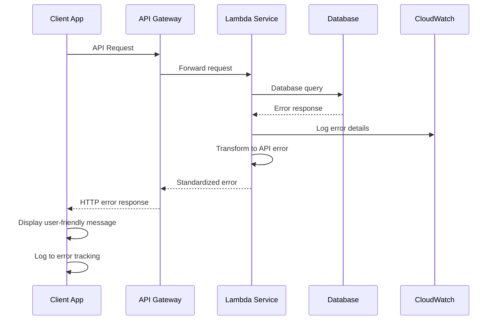

# Error Handling Strategy

## Error Flow



## Error Response Format

```typescript
interface ApiError {
  error: {
    code: string;
    message: string;
    details?: Record<string, any>;
    timestamp: string;
    requestId: string;
  };
}
```

## Frontend Error Handling

```typescript
import { toast } from 'react-native-toast-message';

interface ErrorHandlerOptions {
  showToast?: boolean;
  logError?: boolean;
  fallbackMessage?: string;
}

export class ErrorHandler {
  static handle(
    error: any, 
    options: ErrorHandlerOptions = {}
  ): void {
    const {
      showToast = true,
      logError = true,
      fallbackMessage = 'Something went wrong. Please try again.',
    } = options;

    let message = fallbackMessage;
    let errorCode = 'UNKNOWN_ERROR';

    // Parse API error response
    if (error.response?.data?.error) {
      const apiError = error.response.data.error;
      message = apiError.message || fallbackMessage;
      errorCode = apiError.code || 'API_ERROR';
    } else if (error.message) {
      message = error.message;
      errorCode = 'CLIENT_ERROR';
    }

    // Log error for debugging
    if (logError) {
      console.error('Error occurred:', {
        code: errorCode,
        message,
        stack: error.stack,
        timestamp: new Date().toISOString(),
      });

      // Send to error tracking service
      if (process.env.NODE_ENV === 'production') {
        // Sentry.captureException(error);
      }
    }

    // Show user-friendly message
    if (showToast) {
      toast.show({
        type: 'error',
        text1: 'Error',
        text2: message,
        visibilityTime: 4000,
      });
    }
  }

  static async handleAsync<T>(
    asyncFunction: () => Promise<T>,
    options?: ErrorHandlerOptions
  ): Promise<T | null> {
    try {
      return await asyncFunction();
    } catch (error) {
      this.handle(error, options);
      return null;
    }
  }
}

// Usage in components
export const useBusinessService = () => {
  const searchBusinesses = useCallback(async (filters: BusinessFilters) => {
    return ErrorHandler.handleAsync(
      () => businessService.searchBusinesses(filters),
      { fallbackMessage: 'Failed to search businesses. Please try again.' }
    );
  }, []);

  return { searchBusinesses };
};
```

## Backend Error Handling

```typescript
import { APIGatewayProxyResult } from 'aws-lambda';

export enum ErrorCode {
  VALIDATION_ERROR = 'VALIDATION_ERROR',
  AUTHENTICATION_ERROR = 'AUTHENTICATION_ERROR',
  AUTHORIZATION_ERROR = 'AUTHORIZATION_ERROR',
  NOT_FOUND = 'NOT_FOUND',
  CONFLICT = 'CONFLICT',
  RATE_LIMIT_EXCEEDED = 'RATE_LIMIT_EXCEEDED',
  EXTERNAL_SERVICE_ERROR = 'EXTERNAL_SERVICE_ERROR',
  DATABASE_ERROR = 'DATABASE_ERROR',
  INTERNAL_SERVER_ERROR = 'INTERNAL_SERVER_ERROR',
}

export class ApiError extends Error {
  constructor(
    public code: ErrorCode,
    public message: string,
    public statusCode: number = 500,
    public details?: Record<string, any>
  ) {
    super(message);
    this.name = 'ApiError';
  }
}

export function errorHandler(error: any): APIGatewayProxyResult {
  const requestId = generateRequestId();
  const timestamp = new Date().toISOString();

  // Log error details
  console.error('API Error:', {
    requestId,
    timestamp,
    error: error.message,
    stack: error.stack,
    code: error.code || 'UNKNOWN',
  });

  // Handle known error types
  if (error instanceof ApiError) {
    return {
      statusCode: error.statusCode,
      headers: {
        'Content-Type': 'application/json',
        'X-Request-ID': requestId,
      },
      body: JSON.stringify({
        error: {
          code: error.code,
          message: error.message,
          details: error.details,
          timestamp,
          requestId,
        },
      }),
    };
  }

  // Handle validation errors
  if (error.name === 'ValidationError') {
    return {
      statusCode: 400,
      headers: {
        'Content-Type': 'application/json',
        'X-Request-ID': requestId,
      },
      body: JSON.stringify({
        error: {
          code: ErrorCode.VALIDATION_ERROR,
          message: 'Validation failed',
          details: error.details,
          timestamp,
          requestId,
        },
      }),
    };
  }

  // Handle database errors
  if (error.code === '23505') { // PostgreSQL unique violation
    return {
      statusCode: 409,
      headers: {
        'Content-Type': 'application/json',
        'X-Request-ID': requestId,
      },
      body: JSON.stringify({
        error: {
          code: ErrorCode.CONFLICT,
          message: 'Resource already exists',
          timestamp,
          requestId,
        },
      }),
    };
  }

  // Generic server error
  return {
    statusCode: 500,
    headers: {
      'Content-Type': 'application/json',
      'X-Request-ID': requestId,
    },
    body: JSON.stringify({
      error: {
        code: ErrorCode.INTERNAL_SERVER_ERROR,
        message: 'Internal server error',
        timestamp,
        requestId,
      },
    }),
  };
}

// Helper functions for common errors
export const notFound = (resource: string) => 
  new ApiError(ErrorCode.NOT_FOUND, `${resource} not found`, 404);

export const unauthorized = (message = 'Authentication required') =>
  new ApiError(ErrorCode.AUTHENTICATION_ERROR, message, 401);

export const forbidden = (message = 'Access denied') =>
  new ApiError(ErrorCode.AUTHORIZATION_ERROR, message, 403);

export const validationError = (details: Record<string, any>) =>
  new ApiError(ErrorCode.VALIDATION_ERROR, 'Validation failed', 400, details);

// Usage in Lambda functions
export const handler = async (event: APIGatewayProxyEvent) => {
  try {
    const user = await authenticateUser(event);
    if (!user) {
      throw unauthorized();
    }

    const business = await businessService.getById(event.pathParameters?.id);
    if (!business) {
      throw notFound('Business');
    }

    return successResponse(200, business);
  } catch (error) {
    return errorHandler(error);
  }
};
```
