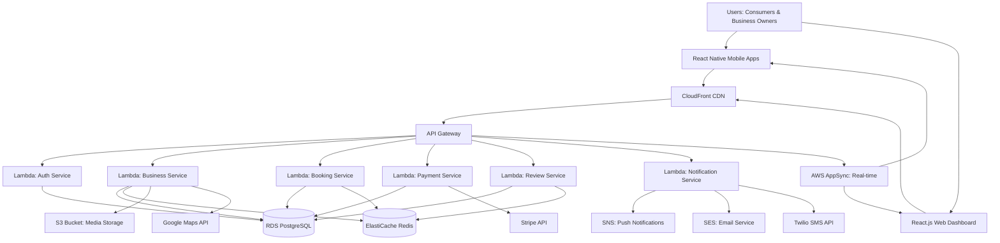

# High Level Architecture

## Technical Summary

Buy Locals implements a cloud-native microservices architecture within a monorepo structure, leveraging AWS infrastructure for scalability and reliability. The platform features React Native mobile applications and a React.js web dashboard communicating with Node.js/Express microservices through RESTful APIs. Key integration points include real-time WebSocket connections for notifications, Redis caching for performance optimization, and PostgreSQL for persistent data storage. The architecture emphasizes horizontal scalability, supporting multi-market expansion while maintaining sub-second response times and 99.5% uptime requirements through auto-scaling Lambda functions and managed AWS services.

## Platform and Infrastructure Choice

**Platform:** AWS (Amazon Web Services)

**Key Services:** 
- AWS Lambda (serverless compute)
- Amazon API Gateway (API management)  
- Amazon RDS PostgreSQL (managed database)
- Amazon ElastiCache Redis (caching)
- Amazon S3 (file storage)
- Amazon CloudFront (CDN)
- Amazon Cognito (authentication)
- AWS AppSync (real-time features)

**Deployment Host and Regions:** Primary deployment in US-East-1 (N. Virginia) with CloudFront global edge locations for optimal performance across target markets.

**Rationale:** AWS provides the most comprehensive serverless ecosystem with proven scalability for marketplace applications. The serverless-first approach aligns with the startup's need for cost optimization while supporting rapid scaling to 25+ markets. AWS managed services reduce operational overhead while providing enterprise-grade security and compliance capabilities required for payment processing.

## Repository Structure

**Structure:** Monorepo with Turborepo

**Monorepo Tool:** Turborepo for build optimization and caching

**Package Organization:** Domain-driven packages with shared libraries for cross-platform consistency

The monorepo approach facilitates code sharing between React Native mobile apps and React.js web dashboard while maintaining clear boundaries between frontend and backend concerns. Turborepo's intelligent caching system optimizes build times across the entire codebase.

## High Level Architecture Diagram

## Architectural Patterns

- **Serverless Microservices:** Lambda-based services for automatic scaling and cost optimization - _Rationale:_ Eliminates server management overhead while providing infinite scaling potential for marketplace growth
- **API Gateway Pattern:** Centralized API management with authentication, rate limiting, and monitoring - _Rationale:_ Provides single entry point for all client requests with built-in security and observability
- **Event-Driven Architecture:** Asynchronous processing using SNS/SQS for notifications and background tasks - _Rationale:_ Ensures responsive user experience while handling time-intensive operations like payment processing and email delivery
- **CQRS Pattern:** Separate read/write models for complex queries and high-performance data access - _Rationale:_ Optimizes database performance for marketplace scenarios with heavy read operations (business discovery) and critical write operations (bookings/payments)
- **Component-Driven Development:** Reusable React components with TypeScript for both mobile and web platforms - _Rationale:_ Maximizes code reuse and maintains consistency across all user touchpoints
- **Repository Pattern:** Abstract data access layer for database operations - _Rationale:_ Enables testability and potential database migration flexibility as the platform scales
